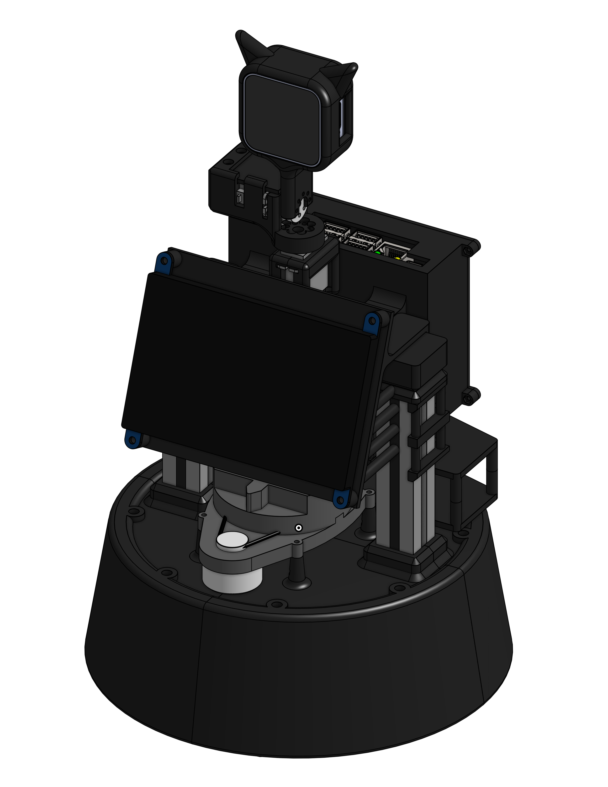
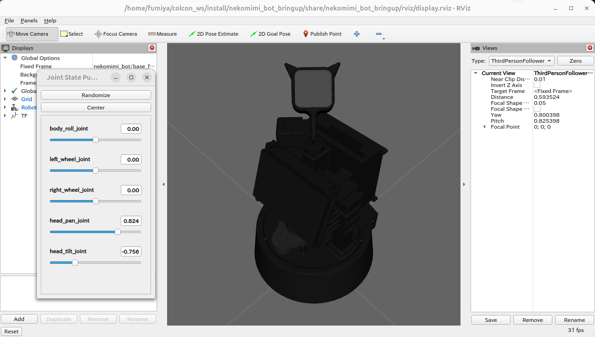
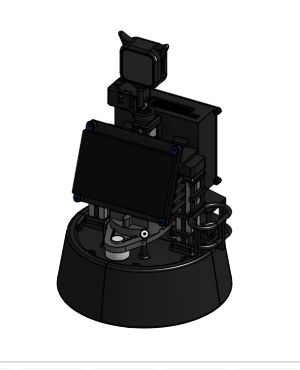

<a name="readme-top"></a>

[JA](README.md) | [EN](README.en.md)

[![Contributors][contributors-shield]][contributors-url]
[![Forks][forks-shield]][forks-url]
[![Stargazers][stars-shield]][stars-url]
[![Issues][issues-shield]][issues-url]
[![License][license-shield]][license-url]

# NekoMimi Bot

<details>
  <summary>目次</summary>
  <ol>
    <li><a href="#概要">概要</a></li>
    <li>
      <a href="#セットアップ">セットアップ</a>
      <ul>
        <li><a href="#環境条件">環境条件</a></li>
        <li><a href="#インストール方法">インストール方法</a></li>
      </ul>
    </li>
    <li>
      <a href="#操作方法">操作方法</a>
      <ul>
        <li><a href="#ホストPC(Jetson)">ホストPC(Jetson)</a></li>
        <li><a href="#ローカルPC">ローカルPC</a></li>
      </ul>
      <a href="#rviz上の可視化">rviz上の可視化</a>
    </li>
    <li>
      <a href="#ソフトウェア">ソフトウェア</a>
      <ul>
        <li><a href="#ジョイント関連のアクションサーバー">ジョイント関連のアクションサーバー</a></li>
        <li><a href="#リニア関連のアクションサーバー">リニア関連のアクションサーバー</a></li>
        <li><a href="#ポーズの設定方法">ポーズの設定方法</a></li>
      </ul>
    </li>
    <li>
      <a href="#ハードウェア">ハードウェア</a>
      <ul>
        <li><a href="#パーツのダウンロード方法">パーツのダウンロード方法</a></li>
        <li><a href="#電子回路図">電子回路図</a></li>
        <li><a href="#ロボットの組み立て">ロボットの組み立て</a></li>
        <li><a href="#ロボットの特徴">ロボットの特徴</a></li>
        <li><a href="#部品リストbom">部品リスト（BOM）</a></li>
      </ul>
    </li>
    <li><a href="#マイルストーン">マイルストーン</a></li>
    <li><a href="#参考文献">参考文献</a></li>
  </ol>
</details>

## 概要


NekoMimi Botを動かすためのライブラリ．

## セットアップ
ここで，本レポジトリのセットアップ方法について説明します．

### 環境条件
まず，以下の環境を整えてから，次のインストール段階に進んでください．

| System  | Version |
| --- | --- |
| Ubuntu | 22.04 (Jammy Jellyfish) |
| ROS    | Humble Hawksbill |
| Python | 3.10 |

### インストール方法

1. ROS2の`src`フォルダに移動します．
    ```sh
    cd ~/colcon_ws/src/
    ```

2. 本レポジトリをcloneします．
   ```sh
   git clone -b humble-devel https://github.com/OnoFumiya/nekomimi_bot
   ```
3. レポジトリの中へ移動します．
   ```sh
   cd nekomimi_bot/
   ```
4. 依存パッケージをインストールします．
   ```sh
   bash install.sh
   ```
5. パッケージをコンパイルします．
    ```sh
    cd ~/colcon_ws
    colcon build --symlink-install
    source ~/colcon_ws/install/setup.sh
    ```

## 操作方法
### ホストPC(Jetson)
### ローカルPC
1. [real_minimal.launch](nekomimi_bot_bringup/launch/real_minimal.launch.py)というlaunchファイルを起動します．
   ```sh
   ros2 launch nekomimi_bot_bringup real_minimal.launch.py
   ```
2. [任意] ロボットのポーズを変更してみましょう．
   ```sh
   ros2 action send_goal /nekomimi_bot/move_to_pose nekomimi_bot_interfaces/action/MoveToPose "pose_name: 'detecting_pose'
   time_allowance:
      sec: 5
      nanosec: 0"
   ```
   <!-- 2番についてはホストPC(Jetson)でもローカルPCでもどちらでも可能 -->

## Rviz上の可視化
実機を動かす前段階で，Rviz上でNekoMimi Botを可視化し，ロボットの構成を表示することができます．

```sh
ros2 launch nekomimi_bot_description display.launch.py
```

正常に動作した場合は，次のようにRvizが表示されます．



## ソフトウェア
<details>
<summary>NekoMimi Botと関わるソフトの情報まとめ</summary>

### ジョイント関連のアクションサーバー

1. `/nekomimi_bot/move_joint`：指定した関節を指定した角度に動かす
   ```sh
   ros2 action send_goal /nekomimi_bot/move_joint nekomimi_bot_interfaces/action/MoveJoint "target_joint_names: ['head_tilt_joint', 'head_pan_joint']
   target_joint_rad: [0.78, -0.2]
   time_allowance:
      sec: 5
      nanosec: 0"
   ```
   <details>
   <summary>NekoMimi Botのジョイント名</summary>

   | ジョイント名 |
   | :--- |
   | head_pan_joint |
   | head_tilt_joint |

2. `/nekomimi_bot/move_to_pose`：事前に指定したポーズに動かす
   ```sh
   ros2 action send_goal /nekomimi_bot/move_to_pose nekomimi_bot_interfaces/action/MoveToPose "pose_name: 'initial_pose'
   time_allowance:
      sec: 5
      nanosec: 0"
   ```

### リニア関連のアクションサーバー

1. `/nekomimi_bot/move_wheel_linear`：指定した速度でロボットを移動させる
   ```sh
   ros2 action send_goal /nekomimi_bot/move_wheel_linear nekomimi_bot_interfaces/action/MoveWheelLinear "target_point:
      x: 1.0
      y: -0.5
      z: 0.0
   time_allowance:
      sec: 3
      nanosec: 0"
   ```

2. `/nekomimi_bot/move_wheel_rotate`：指定した角度でロボットを回転させる
   ```sh
   ros2 action send_goal /nekomimi_bot/move_wheel_rotate nekomimi_bot_interfaces/action/MoveWheelRotate "target_yaw: -1.57
   time_allowance:
      sec: 5
      nanosec: 0"
   ```

#### ポーズの設定方法

[nekomimi_bot_pose.yaml](nekomimi_bot_library/config/pose_list.yaml)というファイルでポーズの追加・編集ができます．以下のようなフォーマットになります．

```yaml
/**:
  ros__parameters:
    poses:
      - initial_pose

    initial_pose:
      head_pan  :  0.0
      head_tilt :  0.0
```
</details>

## ハードウェア

NekoMimi Botはオープンソースハードウェアとして [Onshape](https://cad.onshape.com/documents/a085ea4db45b14d2ae110243/w/7ac4cf7de5a48b62c0d544c0/e/fe620bf9906d8a5ba8b4f91b?renderMode=0&uiState=6a11eb768d8f51332c48bb29) にて公開しております．



<details>
<summary>ハードウェアの詳細についてはこちらを確認してください．</summary>

### パーツのダウンロード方法

1. Onshapeにアクセス．
2. `Instance`の中にパーツを右クリックで選択．
3. 一覧が表示され，`Export`ボタンを押す．
4. 表示されたウィンドウの中に，`Format`という項目があるので，`STEP`を選択．
5. 青色の`Export`ボタンを押してダウンロード開始．

### 電子回路図
TBD

### ロボットの組み立て
TBD

### ロボットの特徴
TBD
<!-- | 項目 | 詳細 | -->
<!-- | --- | --- | -->
<!-- | 最大直進速度 | 0.65[m/s] | -->
<!-- | 最大回転速度 | 3.1415[rad/s] | -->
<!-- | 最大ペイロード | 0.35[kg] | -->
<!-- | サイズ (長さx幅x高さ) | 512x418x1122[mm] | -->
<!-- | 重量 | 11.6[kg] | -->
<!-- | リモートコントローラ | PS3/PS4 | -->
<!-- | LiDAR | UST-10LX | -->
<!-- | RGB-D | Intel Realsense D435F | -->
<!-- | スピーカー | モノラルスピーカー | -->
<!-- | マイク | コンデンサーマイク | -->
<!-- | アクチュエータ (アーム) | 2 x XM540-W150, 9 x XM430-W320 | -->
<!-- | 移動機構 | TurtleBot2 | -->
<!-- | 電源 | 2 x Makita 6.0Ah 18V | -->
<!-- | PC接続 | USB | -->

### 部品リスト（BOM）
TBD
<!-- | 部品 | 型番 | 個数 | 購入先 | -->
<!-- | --- | --- | --- | --- | -->
<!-- | --- | --- | 1 | [link]() | -->
<!-- | --- | --- | 1 | [link]() | -->
<!-- | --- | --- | 1 | [link]() | -->
<!-- | --- | --- | 1 | [link]() | -->
<!-- | --- | --- | 1 | [link]() | -->
<!-- | --- | --- | 1 | [link]() | -->
<!-- | --- | --- | 1 | [link]() | -->
<!-- | --- | --- | 1 | [link]() | -->
<!-- | --- | --- | 1 | [link]() | -->
<!-- | --- | --- | 1 | [link]() | -->
<!-- | --- | --- | 1 | [link]() | -->
<!-- | --- | --- | 1 | [link]() | -->
<!-- | --- | --- | 1 | [link]() | -->

</details>

## マイルストーン
参考文献の記入・その他
現時点のバッグや新規機能の依頼を確認するために[Issueページ][issues-url] をご覧ください．

## 参考文献
* [ROS2 Humble](http://wiki.ros.org/humble)
* [ROS2 Control](http://wiki.ros.org/ros2_control)
* [ROS2 Control Gazebo](https://github.com/ros-controls/gz_ros2_control)
* [Feetech ROS2 Driver](https://github.com/ros-physical-ai/feetech_ros2_driver)

[contributors-shield]: https://img.shields.io/github/contributors/OnoFumiya/nekomimi_bot.svg?style=for-the-badge
[contributors-url]: https://github.com/OnoFumiya/nekomimi_bot/graphs/contributors
[forks-shield]: https://img.shields.io/github/forks/OnoFumiya/nekomimi_bot.svg?style=for-the-badge
[forks-url]: https://github.com/OnoFumiya/nekomimi_bot/network/members
[stars-shield]: https://img.shields.io/github/stars/OnoFumiya/nekomimi_bot.svg?style=for-the-badge
[stars-url]: https://github.com/OnoFumiya/nekomimi_bot/stargazers
[issues-shield]: https://img.shields.io/github/issues/OnoFumiya/nekomimi_bot.svg?style=for-the-badge
[issues-url]: https://github.com/OnoFumiya/nekomimi_bot/issues
[license-shield]: https://img.shields.io/github/license/OnoFumiya/nekomimi_bot.svg?style=for-the-badge
[license-url]: LICENSE